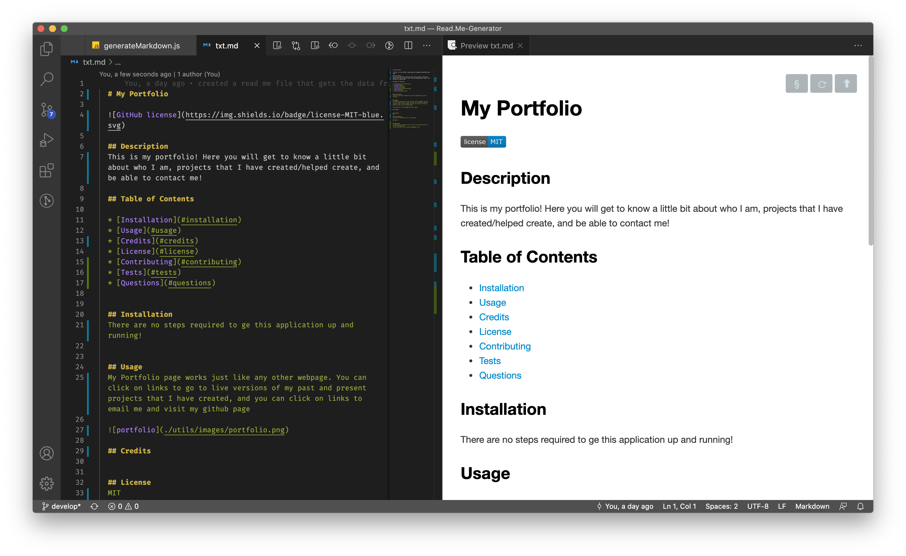
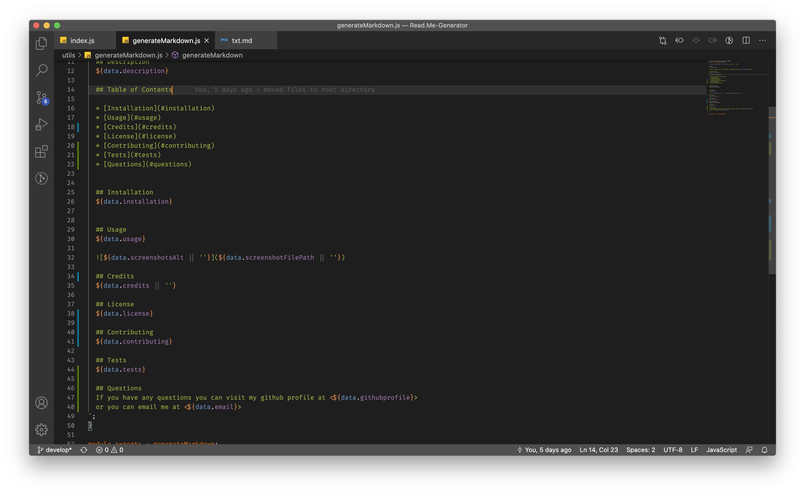
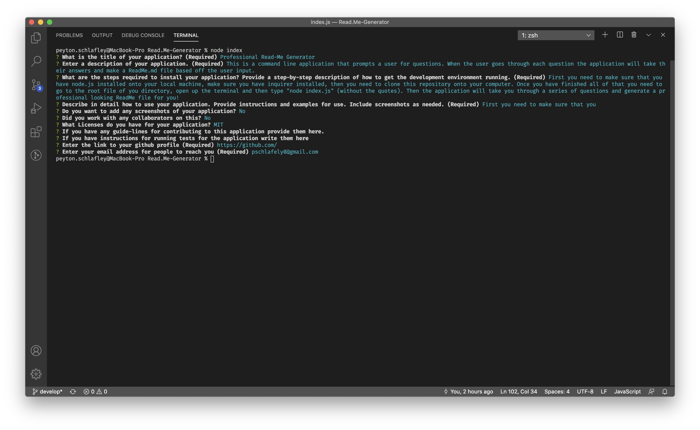
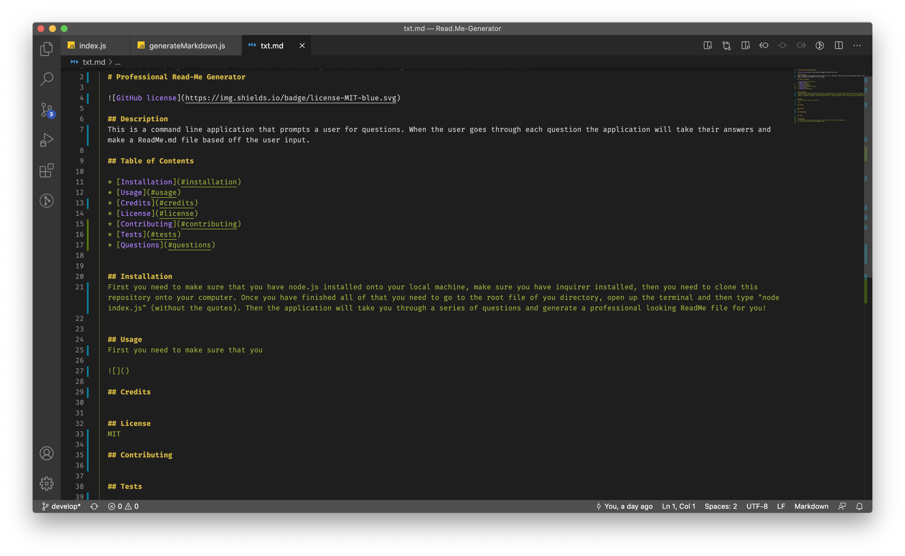

  # ReadMe-Generator

  
  
  ## Description
  You will be able to generate a template for a readMe.md file for your projects. The application goes through best practices for making a readMe and generates it based on how you answer the questions. 

  ## Table of Contents

  * [Installation](#installation)
  * [Usage](#usage)
  * [Credits](#credits)
  * [License](#license)
  * [Questions](#questions)

  ## Installation
  First you need to make sure you have node.js installed onto your local machine. Then you just need to clone the remote repository onto your local machine (you can find the repository at the bottom when you click on the link to my github profile). 
  
  
  ## Usage
  All you have to do is follow the steps provided up above. Then you will open up the terminal in the root directory of your project. Once you are in the terminal you will type "node index.js" (without the quotes of course). Then all you have to do is answer each question and the app will generate a ReadMe template for you! 
  
  >
  
  
    
  

  ## Questions
  If you have any questions you can visit my github profile at <https://github.com/>
  or you can email me at <pschlafley0@gmail.com>